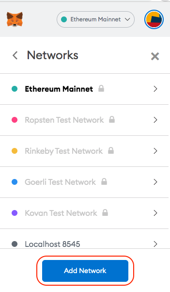

# Create BSC Metamask Wallet

If you didn't already know, you can use Metamask on multiple chains.

Let's talk about the Binance Smart Chain "**BSC**".

The MetaMask extension is available on Chrome and Firefox for Desktop users, you'll also find applications on iOS and Android.   
  
Let's focus on the Chrome version;

1️⃣ Install MetaMask: Click “Add to Chrome” to install MetaMask as a Google Chrome extension.  
2️⃣ Click “Add Extension” to confirm and MetaMask will be added.  
3️⃣ Click on the MetaMask logo, then create a new vault. Set your password.

It's that simple, your wallet should now be ready for action!  
  
But wait, we aren't on BSC yet right? Correct, you now only have an Ethereum wallet.  
  
Let's go to BSC! 🚀🚀🚀  
  
1️⃣ Click the Metamask icon in the top right corner.  
2️⃣ Select "Settings" from the dropdown menu.

3️⃣ In "Settings", scroll down to the "Networks" menu.

4️⃣ Click "Add Network" at the bottom of the menu.

5️⃣ Enter the details below and click "Save".  
  
**Mainnet Network Name:** Binance Smart Chain   
**New RPC URL:** [https://bsc-dataseed.binance.org/](https://bsc-dataseed.binance.org/)  
**ChainID:** 56   
**Symbol:** BNB   
**Block Explorer URL:** [https://bscscan.com](https://bscscan.com)

6️⃣ Congratulations you now have a Binance Smart Chain Metamask wallet! 🚀🚀🚀

7️⃣ Now its time to add your LDFI BEP-20 tokens.  
  
Click the "Add Token" button, under "Custom Token".

Enter the Token Contract Address:  **0xAe1119B918f971F232FED504D48604D5FeF7277F**  
  
Now press "Next" then "Add Tokens".  
  
Your LDFI BEP-20 tokens will now display.

