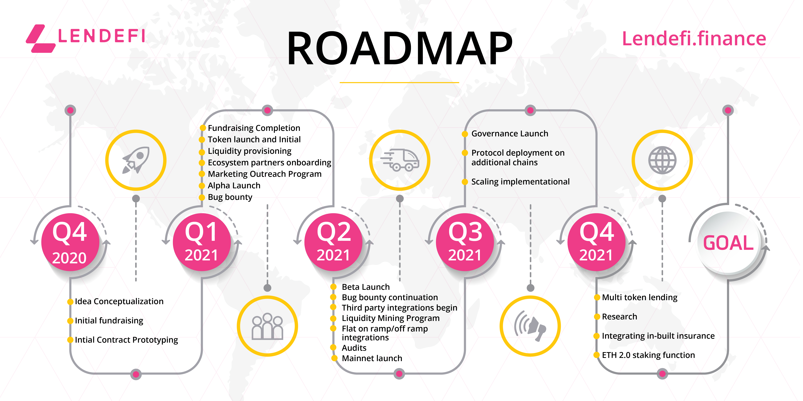

# Roadmap

## **Q4 2020**

_**Idea Conceptualization**_

Lendefi was ideated in an effort to solve the over-collateralization problem with the DeFi protocols of the time. Lendefi represents the answer to a simple question: 

“Why can’t people borrow to trade in crypto assets, like they can for traditional assets such as real estate, cars and stocks?”

_**Initial Fundraising**_

Funds were raised to start work on a permissionless and decentralized Protocol, which would enable anyone to leverage undercollateralized loans for investment in crypto assets.

_**Initial Contract Prototyping**_

Work on the architecture and initial contract prototyping began. The team was chosen and timelines were set for the completion of the Protocol.

## **Q1 2021** 

_**Fundraising Completion**_

The fundraising rounds were completed with multiple investors. The presale was conducted on the FalconPool platform.

_**Token Launch & Initial Liquidity Provisioning**_

The token was launched with initial liquidity provisioning on the Uniswap AMM pool.

_**Ecosystem Partners Onboarding**_

Ecosystem partners include wallet apps, on-ramp providers, DeFi aggregators, information providers etc.

_**Marketing Outreach Program**_

Marketing outreach programs will focus on global expansion and community building exercises. These will include, but will not be limited to, conferences, ambassador programs, influencer outreach, competitions and other community-building activities, both online and offline.

_**Alpha Launch**_

The Alpha launch will include all crucial components of the Protocol. The alpha version will be tested to resolve any bugs and identify the scope for improvement within the Protocol.

_**Bug Bounty**_

The bug bounty campaign will offer generous rewards to the community for identifying Protocol improvements and bugs.

## **Q2 2021** 

_**Beta Launch**_

Beta launch will include all production-ready Protocol components that include the full features of the Lendefi Protocol. Stringent testing of all use cases will be performed to ensure maximum optimization, prior to the main launch.

_**Bug Bounty Continued**_

The bug bounty campaign will continue after the beta launch, to support further improvements to the Protocol.

_**Third-party Integrations Begin**_

Third-party integrations will commence after the alpha launch. These third parties will include wallet apps, information providers and aggregators.

_**Liquidity Mining Program & Rewards**_

Liquidity mining will begin in conjunction with the mainnet launch, in order to bootstrap liquidity and reward initial Protocol users. This program is designed to give governance tokens to users so they are included within the decision-making process of the Protocol.

_**Fiat On-ramp/Off-ramp Integrations**_

Fiat on-ramp/off-ramp partners will offer fast and frictionless paths to add new users to the platform. Integrations with these platforms will make the onboarding experience seamless.

_**Audits**_

Prior to the mainnet launch, Lendefi will engage highly reputable smart contract audit companies to provide a complete audit of the Protocol. Lendefi will ensure that the security of users' funds remains the highest organizational priority.

_**Mainnet Launch**_

The Lendefi Protocol will be launched near the end of the second quarter, once all facets of the Protocol have been tested and passed a stringent audit. At this stage, Lendefi and its primary functions for undercollateralized loans will be available to the public.

## **Q3 2021** 

_**Governance Launch**_

The governance process will launch to involve the community and token holders in the governance of the Protocol. Governance will allow voting proposals on the inclusion/removal of assets, inclusion/removal of changing collateralization ratios, updating liquidation requirements, and proposing changes and improvements to the Protocol.

_**Protocol Deployment On Additional Chains**_

Developing the Lendefi Protocol for compatibility with other chains will be based on community feedback and demand for expansion. Additional chains may include Huobi Chain, Reef and EOS, amongst others. The Protocol will implement Polkadot and leverage the benefits of interoperability during the expansion phase.

_**Scaling Implementation**_

Lendefi will commence work on scaling efforts for the growth and adoption of the Protocol. Some of the factors to be considered in the selection of scaling solutions include; security, liquidity, ease of token migration and other factors to support the ease of Protocol use

## **Q4 2021** 

_**Multi Token Lending**_

The Protocol will be extended to support multiple lending tokens and move from fiat only, to multi-token support for acceptable collateral. The collateralization ratios may vary when borrowing other assets. These ratios will be adjusted based on the team's risk assessment and approval of relevant proposals within the governance DAO.

_**Research**_

Lendefi will establish a research unit to explore areas for further growth and development of the Protocol. This will include both in-house research and/or collaborative efforts with external organizations/individuals working within the sector. Suitable budgets will be provisioned for this initiative.

_**Integrating Built-in Insurance**_

Lendefi will commence development efforts to implement built-in insurance. A portion of the fees collected within the Protocol will be set aside as an insurance fund. Further development will allow the growth of the insurance fund for the long-term operation of the Protocol.

_**ETH 2.0 Staking Function**_

ETH 2.0 staking will be integrated within the Protocol to allow a maximum return on assets purchased through the Lendefi Protocol. This will help to further maximise returns for both lenders and borrowers, making the Protocol more lucrative.  
  
\*\*\* The Protocol has since moved to BSC as the primary release chain.  
  
Further information on the move to BSC [here](https://lendefi.medium.com/lendefi-community-announcement-31-march-2021-9d274609af4c).

